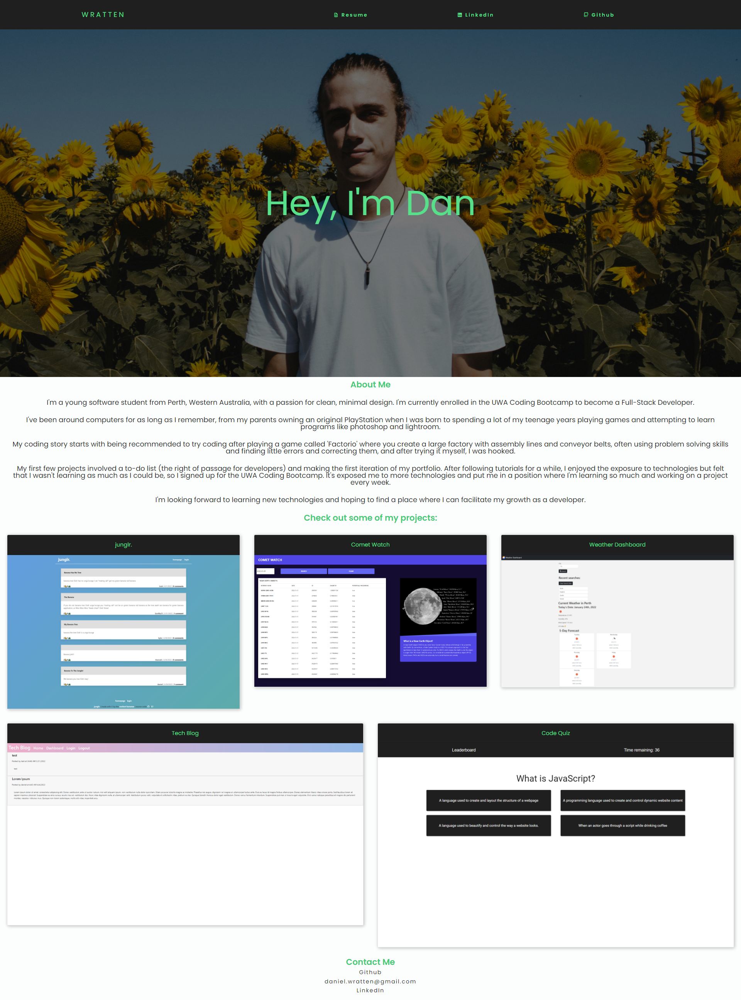

# Portfolio

## Description

    A website with the purpose of displaying my projects and details about me.

## Built With

    HTML
    CSS
    JS
    BootStrap
    jQuery

# 📑 [Deployed Website](https://wratten.github.io/Portfolio/)

## License

      This project is using the MIT license.

## Questions

If you have any questions about this repo please feel free to reach out to me through [GitHub](https://github.com/Wratten) or [Email](mailto:daniel.wratten@gmail.com)
