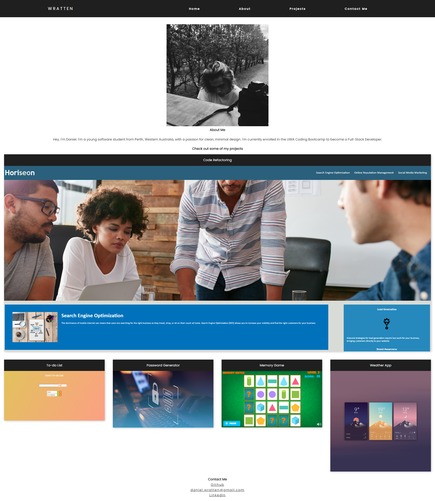

# 📔 Portfolio

A website made using HTML and CSS with the purpose of displaying my projects and details about me using minimal design.

## Includes:

- Navbar with anchor links to sections down the page for easy access
- An image of me
- A brief about me section
- A few of my projects with links to the deployed application on the image
- A few links where I can be contacted

# 📑 [Deployed Website](https://wratten.github.io/Portfolio/)

